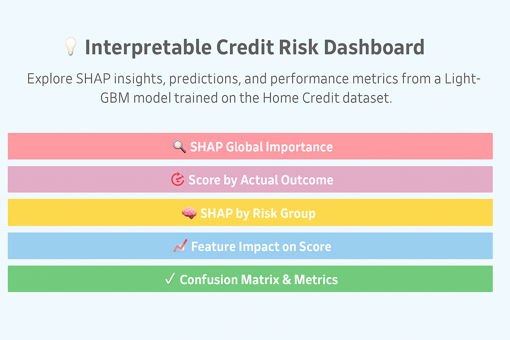

# 🧠 Interpretable Home Credit Risk

This project builds a transparent and explainable credit risk model using the **Home Credit Default Risk dataset**. It is designed to help lenders assess loan applicants with limited credit history—combining machine learning accuracy with **regulator-friendly interpretability** through SHAP and Tableau dashboards.

> 📊 **Live Dashboard**: [Loan Default Risk Analysis (Tableau Public)](https://public.tableau.com/app/profile/saayed.alam/viz/LoanDefaultRiskAnalysisModelResultsSHAPMetrics/0-Overview)

---

## 🖼️ Dashboard Preview

<p align="center">
  
</p>

---

## 🎯 Project Objective

To develop a machine learning pipeline that:
- Predicts the **probability of loan default** using LightGBM
- Explains individual and global model decisions using **SHAP**
- Translates results into **interactive, stakeholder-friendly Tableau dashboards**

---

## 📌 Key Results & Highlights

- 🔍 Achieved clear **SHAP-based interpretability** for all predictions  
- 🧮 Final model: **LightGBM with Optuna tuning**, threshold = 0.30  
- 🧠 Global & local insights transformed into **5 core Tableau visualizations**  
- ✅ Structured outputs for **auditors, risk managers, and product teams**

---

## 📂 Project Structure

```
home-credit-risk/
│
├── data/
│   ├── processed/              # Cleaned & encoded datasets
│   └── final/                  # Tableau-ready CSV outputs
│
├── models/                     # Final trained LightGBM model
│
├── notebooks/
│   ├── 1_data_cleaning.ipynb   # Missing values, encoding, class imbalance
│   ├── 2_modeling.ipynb        # Optuna tuning, LightGBM, SHAP summary
│   ├── 3_explainability.ipynb  # SHAP visualizations & ratios
│   └── 4_tableau_export.ipynb  # CSVs for dashboard integration
│
├── dashboard/
│   └── overview.png            # Static image of dashboard homepage
│
└── README.md                   # This file
```

---

## 📈 Tableau Dashboard Overview

The following CSV exports power a full Tableau Public dashboard:

| 🔢 Visualization                   | 📁 CSV Export                             | Description                                |
|-----------------------------------|-------------------------------------------|--------------------------------------------|
| SHAP Global Importance            | `global_shap_importance.csv`              | Top features by global SHAP impact         |
| Score Distribution by Label       | `risk_distribution.csv`                   | Predicted score distribution by outcome    |
| SHAP by Risk Band                 | `agg_shap_by_risk_band.csv`               | Feature impact segmented by risk group     |
| SHAP vs Risk Score                | `shap_vs_risk_long.csv`                   | SHAP contribution vs predicted probability |
| Confusion Matrix                  | `confusion_prediction_only.csv`, `confusion_summary.csv` | Prediction outcomes and metrics   |

---

## ⚙️ Setup & Requirements

> Clone the repo and install required libraries:

```bash
git clone git@github.com:saayedalam/interpretable-home-credit-risk.git
cd interpretable-home-credit-risk
pip install -r requirements.txt
```

> 🔒 **Note**: Raw dataset (`application_train.csv`) is excluded due to file size.  
> You can download it manually from [Kaggle](https://www.kaggle.com/competitions/home-credit-default-risk/data).

---

## 📜 License

This project is open-sourced under the MIT License. See `LICENSE` for details.

---

## 👋 Credits

Built by **Saayed Alam**  
Designed for **data analysts and ML professionals** seeking to deliver transparent, human-centered risk models.
